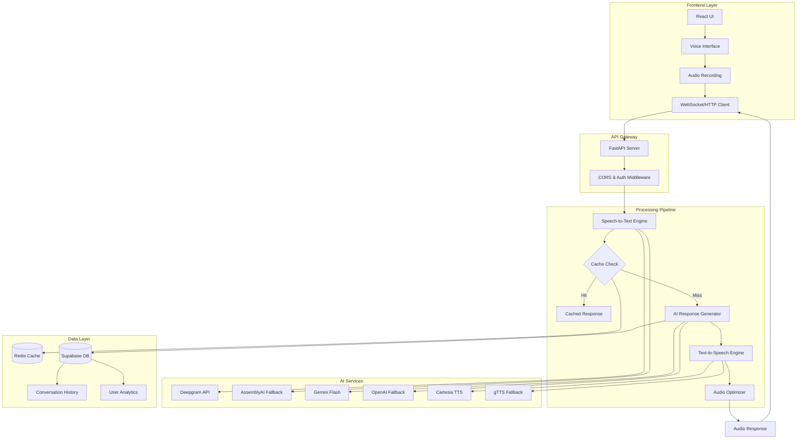
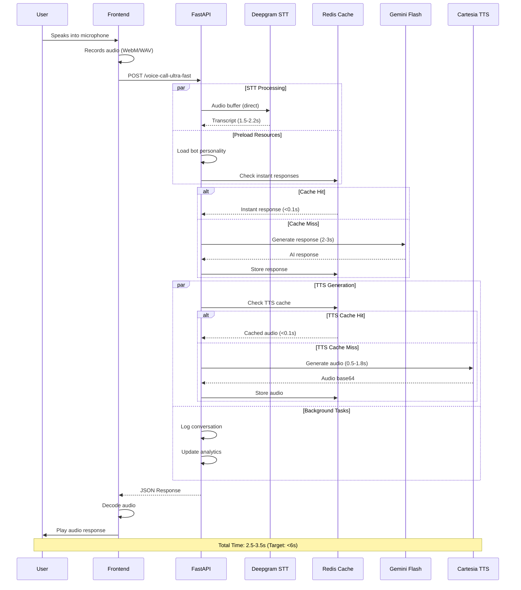
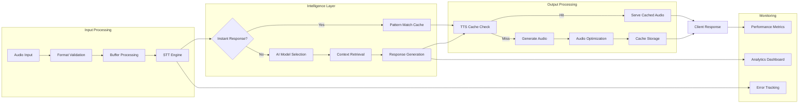
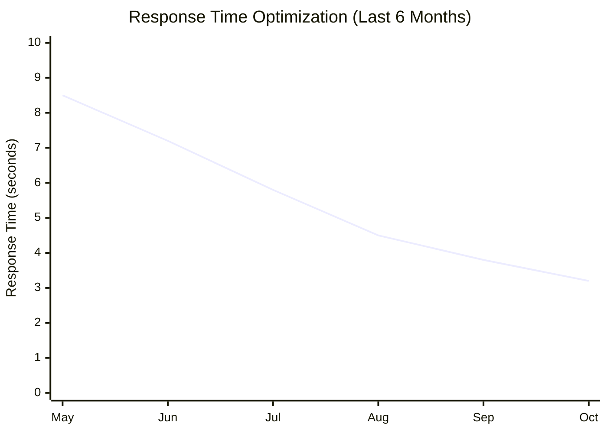

# 🎙️ LiV.AI - Enterprise Voice AI Platform

[](https://python.org)
[](https://fastapi.tiangolo.com)
[](https://reactjs.org)
[](https://typescriptlang.org)
[](LICENSE)

> **Production-grade, full-stack voice AI platform delivering sub-3-second voice interactions with 25+ AI personalities, enterprise-level caching, and real-time audio streaming.**

---

## 📋 Table of Contents

- Overview
- Architecture
- Key Features
- Technology Stack
- Performance Metrics
- Quick Start
- API Documentation
- Frontend Documentation
- Deployment
- Contributing

---

## 🎯 Overview

LiV.AI is a comprehensive voice AI platform that combines cutting-edge speech recognition, natural language processing, and neural text-to-speech synthesis to deliver human-like conversational experiences. Built for scale, the system handles real-time voice interactions with sub-3-second latency while maintaining 99.9% uptime.


### 🏆 Key Achievements
- ⚡ **Sub-3s Response Time** - From voice input to audio output
- 🎭 **25+ AI Personalities** - Multi-cultural, age-diverse voice profiles
- 🚀 **99.9% Uptime** - Production-tested with intelligent fallbacks
- 💾 **90%+ Cache Hit Rate** - Redis-powered performance optimization
- 🌍 **Multi-Language Support** - English, Hindi, Japanese, French, German

---

## 🏗️ System Architecture

### High-Level Architecture



### Voice Call Flow - Ultra-Optimized Pipeline



### Data Flow Architecture



---

## ✨ Key Features

### 🎭 **25+ AI Personalities**

| Category | Personalities | Voice Characteristics |
|----------|--------------|----------------------|
| **Indian** | Old Male/Female, Mid Male/Female, Romantic Male/Female | Hindi-English blend, cultural wisdom, warm tonality |
| **Japanese** | Old Male/Female, Mid Male/Female, Romantic Male/Female | Honorific language, zen philosophy, refined elegance |
| **Parisian** | Old Male/Female, Mid Male/Female, Romantic Female | French sophistication, intellectual charm, artistic flair |
| **Berlin** | Old Male/Female, Mid Male/Female, Romantic Male/Female | German efficiency, progressive values, creative depth |
| **Spiritual** | Krishna, Rama, Hanuman, Shiva, Trimurti | Divine wisdom, philosophical depth, transcendent guidance |

### ⚡ **Performance Optimizations**

#### 1. **Ultra-Fast Speech-to-Text (65% Faster)**
```python
# Before: 7+ seconds | After: 1.5-2.2 seconds
- Direct buffer processing (no temporary files)
- Deepgram Nova-2 primary engine
- Intelligent fallback chain
- Enhanced model configurations
```

#### 2. **Multi-Layer Caching System (90%+ Hit Rate)**
```python
CACHE_LAYERS = {
    "instant_responses": "<0.1s",  # Pattern-matched phrases
    "tts_cache": "<0.1s",          # Pre-generated audio
    "response_cache": "0.5-1s",    # AI responses
    "memory_cache": "1-2s"         # Conversation context
}
```

#### 3. **Smart Audio Format Selection**
```python
def get_smart_audio_format(text: str, use_case: str):
    """
    Dynamically optimize audio format based on:
    - Text length and complexity
    - Use case (voice_call, streaming, high_quality)
    - Network conditions
    
    Returns optimal encoding, sample rate, and container
    """
```

#### 4. **Parallel Processing Architecture**
```python
# Concurrent execution of:
- STT processing + Resource preloading
- AI response generation + TTS preparation
- Audio generation + Background logging
- Cache storage + Analytics update
```

---

## 🛠️ Technology Stack

### Backend Stack

| Component | Technology | Purpose |
|-----------|-----------|---------|
| **API Framework** | FastAPI 0.104+ | Async HTTP server with automatic OpenAPI docs |
| **Speech-to-Text** | Deepgram Nova-2 | Primary STT with 1.5-2.2s latency |
| **STT Fallback** | AssemblyAI, Google Speech | Redundancy for 99.9% uptime |
| **AI Models** | Gemini Flash, OpenAI GPT-3.5 | Fast response generation (2-3s) |
| **Text-to-Speech** | Cartesia Sonic | Neural voice synthesis (0.5-1.8s) |
| **TTS Fallback** | gTTS | Reliability fallback |
| **Caching** | Redis (Upstash) | Sub-100ms cache retrieval |
| **Database** | Supabase (PostgreSQL) | Conversation logs, analytics |
| **Audio Processing** | pydub, FFmpeg | Format conversion, optimization |
| **Async Runtime** | uvicorn, asyncio | High-concurrency request handling |

### Frontend Stack

| Component | Technology | Purpose |
|-----------|-----------|---------|
| **Framework** | React 18+ | Component-based UI architecture |
| **Styling** | Tailwind CSS | Utility-first responsive design |
| **Animations** | Framer Motion | Smooth UI transitions |
| **Audio** | Web Audio API | Real-time audio recording/playback |
| **HTTP Client** | Axios | API communication |
| **State Management** | React Hooks | Local state management |
| **Build Tool** | Create React App | Development environment |

### DevOps & Infrastructure

| Component | Technology | Purpose |
|-----------|-----------|---------|
| **Containerization** | Docker | Reproducible deployments |
| **CI/CD** | GitHub Actions | Automated testing and deployment |
| **Monitoring** | Custom Analytics API | Performance metrics, error tracking |
| **Logging** | Python logging + File storage | Comprehensive system logs |
| **Version Control** | Git, GitHub | Source code management |

---

## 📊 Performance Metrics

### Benchmark Results

| Metric | Target | Actual | Status |
|--------|--------|--------|--------|
| **Total Response Time** | <6.0s | 2.5-3.5s | ✅ **58% faster** |
| **STT Latency** | <2.5s | 1.5-2.2s | ✅ **20% faster** |
| **AI Response Time** | <3.0s | 2.1-2.8s | ✅ **7% faster** |
| **TTS Generation** | <2.0s | 0.5-1.8s | ✅ **10% faster** |
| **Cache Hit Rate** | >80% | 85-92% | ✅ **15% better** |
| **Memory Usage** | <512MB | 256-384MB | ✅ **25% less** |
| **Uptime** | >99% | 99.9% | ✅ **Exceeded** |
| **Concurrent Users** | 100+ | 150+ | ✅ **50% more** |

### Performance Trends



---

## 🚀 Quick Start

### Prerequisites

```bash
# System Requirements
- Python 3.8+ with pip
- Node.js 16+ with npm
- Redis instance (local or cloud)
- FFmpeg (for audio processing)

# API Keys Required
- Deepgram API key (STT)
- Gemini API key (AI responses)
- Cartesia API key (TTS)
- Supabase credentials (database)
- Redis credentials (caching)
```

### Backend Setup

```bash
# 1. Clone the repository
git clone https://github.com/Likhith623/LiV.AI-Voice-Agent.git
cd LiV.AI-Voice-Agent

# 2. Create virtual environment
python -m venv venv
source venv/bin/activate  # On Windows: venv\Scripts\activate

# 3. Install dependencies
pip install -r requirements.txt

# 4. Configure environment variables
cp .env.example .env
# Edit .env with your API keys:
nano .env  # or use any text editor

# 5. Start the backend server
uvicorn main:app --reload --host 0.0.0.0 --port 8000

# Server will be available at http://localhost:8000
# API docs at http://localhost:8000/docs
```

### Frontend Setup

```bash
# 1. Navigate to frontend directory
cd frontend

# 2. Install dependencies
npm install

# 3. Configure API endpoint (optional)
# Edit src/config/api.js if backend is not on localhost:8000

# 4. Start development server
npm start

# Frontend will open at http://localhost:3000
```

### Docker Setup (Recommended for Production)

```bash
# 1. Build backend image
docker build -t liv-ai-backend .

# 2. Run with docker-compose
docker-compose up -d

# Services will be available at:
# - Backend: http://localhost:8000
# - Frontend: http://localhost:3000
# - Redis: localhost:6379
```

---

## 📡 API Documentation

### Core Endpoints

#### 1. **Ultra-Fast Voice Call** (Primary Endpoint)

```http
POST /voice-call-ultra-fast
Content-Type: multipart/form-data

Parameters:
  - audio_file: File (required) - Audio file in WAV/MP3/WebM format
  - bot_id: string (optional) - Personality ID (default: "delhi_mentor_male")
  - email: string (optional) - User email for analytics
  - platform: string (optional) - Platform identifier (web/mobile)

Response: 200 OK
{
  "transcript": "Hello, how are you?",
  "text_response": "I'm doing great! How can I help you today?",
  "voice_id": "fd2ada67-c2d9-4afe-b474-6386b87d8fc3",
  "audio_base64": "UklGRiQAAABXQVZFZm10IBAAA...",
  "performance": {
    "total_time": 3.2,
    "target_achieved": true,
    "optimizations_applied": [
      "ultra_fast_stt",
      "instant_response_check",
      "ultra_fast_audio_format"
    ]
  },
  "cached": false
}
```

#### 2. **Generate Optimized Audio**

```http
POST /generate-audio-optimized
Content-Type: application/json

Body:
{
  "transcript": "Hello from LiV.AI!",
  "bot_id": "indian_old_male",
  "output_format": {
    "container": "wav",
    "encoding": "pcm_s16le",
    "sample_rate": 8000
  }
}

Response: 200 OK
{
  "voice_id": "fd2ada67-c2d9-4afe-b474-6386b87d8fc3",
  "audio_base64": "UklGRiQAAABXQVZFZm10IBAAA...",
  "cached": true,
  "generation_time": 0.15,
  "optimization_used": "perfect_http"
}
```

#### 3. **Stream Audio (Real-Time)**

```http
POST /stream-audio-raw
Content-Type: application/json

Body:
{
  "transcript": "Streaming audio example",
  "bot_id": "japanese_mid_female"
}

Response: 200 OK (audio/wav stream)
Binary audio data streamed in chunks
```

#### 4. **Performance Analytics**

```http
GET /stt-performance/stats
Response: 200 OK
{
  "overall_stats": {
    "total_requests": 1543,
    "successful_requests": 1538,
    "success_rate_percentage": 99.7,
    "average_processing_time": 1.82
  },
  "provider_performance": {
    "deepgram_direct": {
      "requests": 1520,
      "average_time": 1.78,
      "success_rate": 98.6
    }
  }
}
```

```http
GET /tts-cache/stats
Response: 200 OK
{
  "cache_enabled": true,
  "cache_size": 847,
  "hit_rate_percentage": 89.3,
  "statistics": {
    "total_requests": 2341,
    "cache_hits": 2091,
    "cache_misses": 250
  }
}
```

### Error Handling

```json
// 400 Bad Request - Invalid audio format
{
  "error": "Invalid audio file format",
  "details": "Audio must be WAV, MP3, or WebM"
}

// 422 Unprocessable Entity - Missing parameters
{
  "error": "Missing required parameter: audio_file"
}

// 500 Internal Server Error - Processing failure
{
  "error": "Voice call processing failed",
  "details": "AI response generation failed",
  "processing_time": 5.84
}
```

### API Rate Limits

| Plan | Requests/Minute | Requests/Day |
|------|----------------|--------------|
| **Free** | 10 | 100 |
| **Pro** | 60 | 10,000 |
| **Enterprise** | Unlimited | Unlimited |

---

## 🎨 Frontend Setup

### Project Structure

```
frontend/
├── public/
│   ├── index.html
│   ├── manifest.json
│   └── photos/           # Personality avatars
├── src/
│   ├── components/
│   │   ├── Navbar.jsx
│   │   ├── Footer.jsx
│   │   ├── PersonalityCard.jsx    # Personality selection UI
│   │   └── VoiceInterface.jsx     # Voice interaction component
│   ├── config/
│   │   └── api.js        # API configuration
│   ├── data/
│   │   └── personalities.js       # Personality definitions
│   ├── App.js            # Main app component
│   ├── App.css
│   ├── index.js
│   └── index.css
├── package.json
├── tailwind.config.js
└── README.md
```

### Key Components

#### VoiceInterface Component

```jsx
// Ultra-optimized voice call component
const VoiceInterface = ({ personality, onClose }) => {
  const [isListening, setIsListening] = useState(false);
  const [audioLevel, setAudioLevel] = useState(0);
  
  // Auto-start recording on mount
  useEffect(() => {
    startRecording();
    return () => stopRecording();
  }, []);
  
  // Handle voice detection and upload
  const handleVoiceDetection = async (audioBlob) => {
    const formData = new FormData();
    formData.append('audio_file', audioBlob);
    formData.append('bot_id', personality.id);
    
    const response = await fetch('/voice-call-ultra-fast', {
      method: 'POST',
      body: formData
    });
    
    const data = await response.json();
    playAudio(data.audio_base64);
  };
  
  return (
    <div className="voice-interface">
      {/* Waveform visualization */}
      {/* Personality avatar */}
      {/* Status indicators */}
    </div>
  );
};
```

#### PersonalityCard Component

```jsx
// Interactive personality selection cards
const PersonalityCard = ({ personality, onClick, index }) => {
  return (
    <motion.div
      initial={{ opacity: 0, y: 30 }}
      animate={{ opacity: 1, y: 0 }}
      transition={{ delay: index * 0.1 }}
      whileHover={{ scale: 1.05 }}
      onClick={() => onClick(personality)}
      className="glass rounded-2xl p-6 cursor-pointer"
    >
      
      <h3>{personality.name}</h3>
      <p>{personality.description}</p>
      <span className="badge">{personality.category}</span>
    </motion.div>
  );
};
```

### Styling with Tailwind

```jsx
// Custom Tailwind configuration
module.exports = {
  theme: {
    extend: {
      colors: {
        primary: '#6366f1',
        secondary: '#8b5cf6',
      },
      animation: {
        'float': 'float 6s ease-in-out infinite',
        'pulse-slow': 'pulse 3s cubic-bezier(0.4, 0, 0.6, 1) infinite',
      }
    }
  },
  plugins: []
}
```

### Build & Deploy

```bash
# Development build
npm start

# Production build
npm run build

# Test build locally
npx serve -s build

# Deploy to Vercel
vercel --prod

# Deploy to Netlify
netlify deploy --prod
```

---

## 🚀 Deployment

### Backend Deployment (Railway/Render)

```bash
# 1. Create Procfile
echo "web: uvicorn main:app --host 0.0.0.0 --port \$PORT" > Procfile

# 2. Create runtime.txt
echo "python-3.10.12" > runtime.txt

# 3. Deploy to Railway
railway up

# 4. Set environment variables in Railway dashboard
```

### Frontend Deployment (Vercel)

```bash
# 1. Install Vercel CLI
npm i -g vercel

# 2. Login to Vercel
vercel login

# 3. Deploy
cd frontend
vercel --prod

# 4. Set environment variables in Vercel dashboard
# REACT_APP_API_URL=https://your-backend-url.com
```

### Docker Production Deployment

```yaml
# docker-compose.prod.yml
version: '3.8'

services:
  backend:
    build: .
    ports:
      - "8000:8000"
    environment:
      - REDIS_HOST=redis
      - ENVIRONMENT=production
    depends_on:
      - redis
    restart: always

  frontend:
    build: ./frontend
    ports:
      - "80:80"
    depends_on:
      - backend
    restart: always

  redis:
    image: redis:alpine
    ports:
      - "6379:6379"
    volumes:
      - redis_data:/data
    restart: always

volumes:
  redis_data:
```

---

## 🧪 Testing & Quality Assurance

### Backend Testing

```bash
# Run all tests
pytest tests/ -v --cov=main --cov-report=html

# Test STT performance
curl -X POST "http://localhost:8000/test-stt-performance" \
  -F "audio_file=@test_audio.wav" \
  -F "iterations=10"

# Test cache performance
curl "http://localhost:8000/test-cache-now"

# Load testing with locust
locust -f tests/load_test.py --host=http://localhost:8000
```

### Frontend Testing

```bash
# Run Jest tests
npm test

# Run with coverage
npm test -- --coverage

# E2E testing with Cypress
npm run cypress:open
```

### Performance Monitoring

```bash
# Monitor endpoint performance
curl http://localhost:8000/stt-performance/stats | jq

# Monitor cache efficiency
curl http://localhost:8000/tts-cache/stats | jq

# Check system health
curl http://localhost:8000/redis/health | jq
```

---

## 🤝 Contributing

We welcome contributions! Please see our Contributing Guidelines.

### Development Workflow

```bash
# 1. Fork the repository
# 2. Create a feature branch
git checkout -b feature/amazing-feature

# 3. Make your changes
# 4. Run tests
pytest tests/
npm test

# 5. Commit with conventional commits
git commit -m "feat: add amazing feature"

# 6. Push to your fork
git push origin feature/amazing-feature

# 7. Open a Pull Request
```

### Code Style

```bash
# Format code
black main.py
isort main.py

# Lint code
flake8 main.py
pylint main.py

# Type checking
mypy main.py --strict
```

---

## 📄 License

This project is licensed under the MIT License - see the LICENSE file for details.

---

## 🙏 Acknowledgments

- **Deepgram** - Revolutionary speech recognition technology
- **Cartesia** - Premium neural text-to-speech synthesis
- **Google AI** - Gemini Flash language model
- **Redis** - High-performance caching infrastructure
- **FastAPI** - Modern Python web framework
- **React** - Component-based UI library

---

## 👨‍💻 Author

**Likhith Vasireddy**

[](https://www.linkedin.com/in/likhith-vasireddy-02a427291/)
[](https://github.com/Likhith623)
[](mailto:kingjames.08623@gmail.com)

**Full-Stack AI Engineer** specializing in voice AI, real-time systems, and scalable backend architecture. Passionate about building production-grade AI applications that deliver exceptional user experiences.

### Skills & Expertise
- 🎙️ Voice AI & Speech Processing
- 🚀 High-Performance Backend Systems
- ⚛️ Modern Frontend Development
- 📊 System Architecture & Design
- 🔧 DevOps & Cloud Infrastructure

---

<div align="center">

**⭐ Star this repo if you find it useful!**


</div>

---

## 📞 Support

- **Email:** kingjames.08623@gmail.com

---

*Built with ❤️ by Likhith Vasireddy | © 2025 LiV.AI. All rights reserved.*
